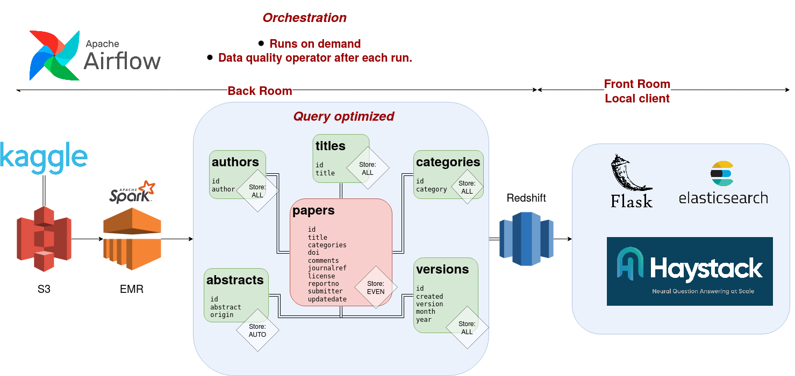
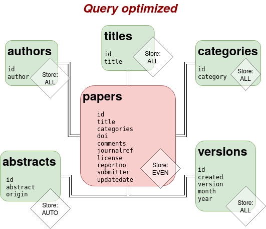
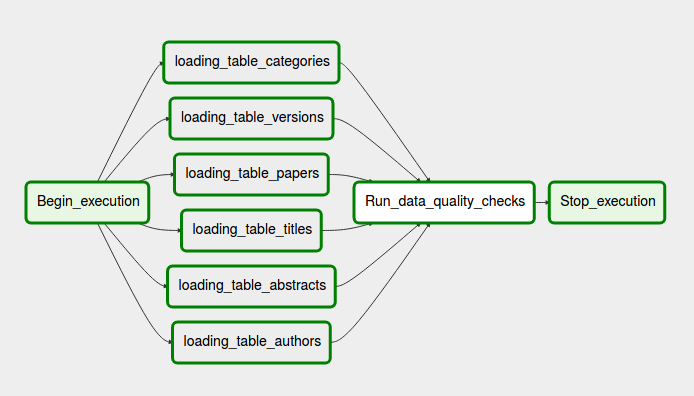
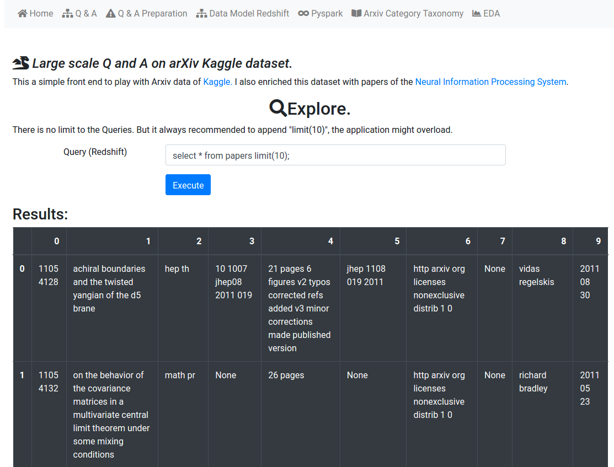
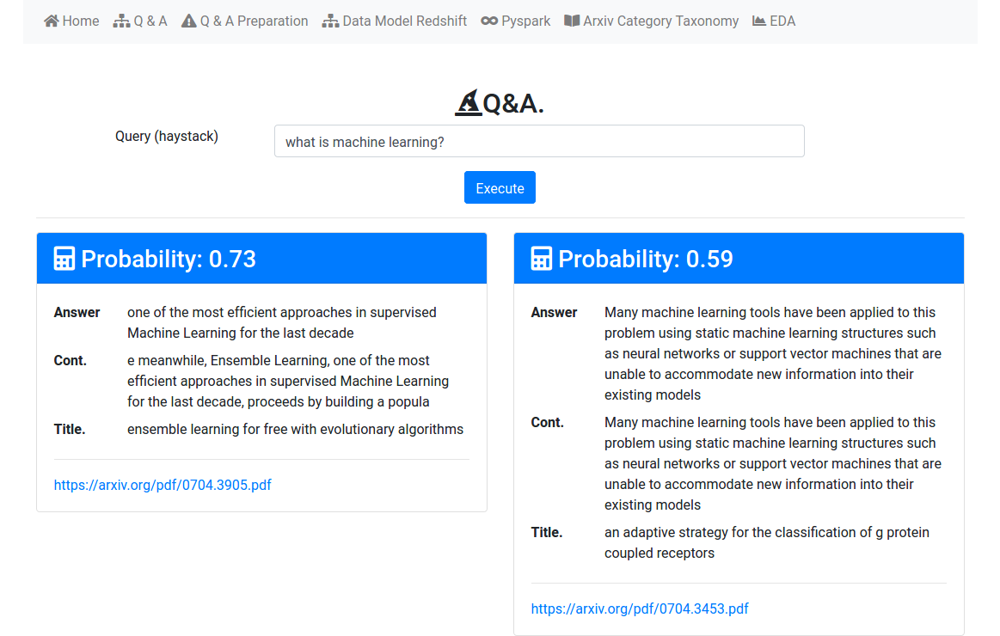

# :star: Explore and ask questions on ArXiv Kaggle dataset.

## Abstract
Using [Arxiv](https://www.kaggle.com/Cornell-University/arxiv)  and [Neural Information Processing System](https://www.kaggle.com/benhamner/nips-papers) datasets I created a relational database model that allows the user to do Ad-Hoc queries for analytics. Using haystack the application allows for question and answering on user defined abstracts of the database. 

**Keywords:** S3, Amazon Elastic MapReduce, Pyspark, Airflow, Redshift, Flask, NLP, Q&A, Haystack,Machine Learning, Full stack development, Data Engineering.




## My vision
The project has two main parts. The back end was designed to run in the cloud. 
This includes storage in S3 (raw files and the parquet model), EMR processing, 
and relational database in Redshift. This would allow this back-end to serve multiple applications.
 The other part is
the front end, on the local / client side, this means that a local user is 
expected to have the web interface on Flask. 
This would allow him/her to query the Redshift database plus the additional 
ability to ask questions about documents of interest. 
I imagine a local user, setting up the flask app and then browsing the 
database with it, then later indexing on their local elastic search server, 
the abstract and title of the article of interest, this could mean
filtering by a particular topic, year, or author. 
After the indexing, the user can ask questions of the type *what do we know about the uncertainty principle?*. 
The answer will come on the form of a bootstrap card, with scores, possible answers, 
full paper URL pdf access to the document. 
The question and answering system is possible with [haystack](https://github.com/deepset-ai/haystack). The following are the core features of haystack on their github.


+ Powerful ML models: Utilize all latest transformer based models (BERT, ALBERT, RoBERTa ...)
+ Modular \& future-proof: Easily switch to newer models once they get published.
+ Developer friendly: Easy to debug, extend and modify.
+ Scalable: Production-ready deployments via Elasticsearch backend \& REST API
+ Customizable: Fine-tune models to your own domain \& improve them continuously via user feedback


# The data

I used the [Arxiv](https://www.kaggle.com/Cornell-University/arxiv)  and Neural Information Processing 
    Systems ([NIPS](https://www.kaggle.com/benhamner/nips-papers)) datasets from kaggle. I hosted both files on a S3: 
\emph{s3a://arxivs3/input_data/arxiv-metadata-oai-snapshot.json}, \emph{s3a://arxivs3/input_data/NIPS.csv}. 


```
>>> df_arxiv.printSchema()
root
 |-- abstract: string (nullable = true)
 |-- authors: string (nullable = true)
 |-- authors_parsed: array (nullable = true)
 |    |-- element: array (containsNull = true)
 |    |    |-- element: string (containsNull = true)
 |-- categories: string (nullable = true)
 |-- comments: string (nullable = true)
 |-- doi: string (nullable = true)
 |-- id: string (nullable = true)
 |-- journal-ref: string (nullable = true)
 |-- license: string (nullable = true)
 |-- report-no: string (nullable = true)
 |-- submitter: string (nullable = true)
 |-- title: string (nullable = true)
 |-- update_date: string (nullable = true)
 |-- versions: array (nullable = true)
 |    |-- element: struct (containsNull = true)
 |    |    |-- created: string (nullable = true)
 |    |    |-- version: string (nullable = true)
>>> df_papers_nips.printSchema()
root
 |-- id: string (nullable = true)
 |-- year: string (nullable = true)
 |-- title: string (nullable = true)
 |-- abstract: string (nullable = true)
```


# The data model
Initially, I thought having a star schema would be the correct choice. It would offer a degree of normalization, while still providing an easy to understand data model. Nonetheless, upon trying to implement it, I realized that a query optimized model, where you have a table per query seems more appropriate, that way, in principle, you could train machine learning models per table, without having to refer to the fact table or others tables. On the other hand, I also envisioned non-technical users exploring basic trends, or asking questions about popular authors or topics in a given year. In the end, my data model resembles the star schema, allowing for ad hoc queries, while at the same time provides query optimized tables for machine learning. This hybrid approach was the main reason to select AWS Redshift cluster as the host of the model. Redshift provides Postgresql-like query language suitable for non-technical users while being Massively parallel processing (MPP) to operate on large amounts of Data. Additionally, Redshift is easily integrated with python3 with the *psycopg2* module (for front-end) and with *Airflow* through the Postgres operator.



## ETL
Once I designed the data model and selected the hosting technology, I constructed the ETL scripts. I used \emph{PySpark} to transform the json and csv into DataFrames, process them and then leave them on S3 as parquet files. *Spark*, in contrast to Redshift, supports json data manipulation, it is also parallelizable and comes with machine learning libraries. It is able to store data as parquet files, a columnar format particularity suitable for big data.

Most of the transformations involved flattening the nested data from the original .json, with the occasional use of regular expressions to extract temporal features of the records. All this process can be found in 


## ETL Orchestration with Airflow
*Airflow* allows for ETL Orchestration with its webserver. I created tree Dags. [create_tables_redshift](https://github.com/gariciodaro/arXiv-haystack-app/blob/master/back_end/dags/createRedShiftDB.py) allows you to create the structure on Redshift of the data model. [create_parquet_area](https://github.com/gariciodaro/arXiv-haystack-app/blob/master/back_end/dags/sparkPreProcess.py) runs [pysparkCreateParquets_TEMP.py](https://github.com/gariciodaro/arXiv-haystack-app/blob/master/back_end/scripts/pysparkCreateParquets_TEMP.py) script, and finally [load_data_to_redshift](https://github.com/gariciodaro/arXiv-haystack-app/blob/master/back_end/dags/RedShiftDataModel.py) copies the parquet files to Redshift and performs data quality checks (volumne checnk, and id nullity).

All the DAGs are set to run on demand, this means that a user would have to trigger the dag to actually execute it. If the user wanted to setup the automatic execution, for example *daily basis by 7am* all he/she needs to do is change the dag configuration in  *load_data_to_redshift*.

```
args = {
    'owner': 'arXiv-haystack-app',
    'start_date': datetime.datetime.utcnow(),
    'catchup': False,
    'depends_on_past':False
}
dag = DAG(
        dag_id='create_parquet_area',
        default_args=args,
        schedule_interval='30 7 * * *')
        )
```
The whole development is ready to handle a 100x increase in data thanks to *PySpark* scalability, and to withstand high user concurrency thanks to *Redshift* MPP nature.




# Front-end
I used Flask to create a web interface that queries the redshifts back-end. My original idea was to allow users to explore the database to select a subset of papers and then add the full-text paper to an elastic search cluster (key-pair document storage) for machine learning exploitation. Unfortunately the full pdfs of Arxiv are not available for *wget* download, which I found out after finishing the code (can be seen on branch pdf_fail_aws). This pipeline consisted of obtaining the URL from Redshift, downloading the pdf to the client, and then upload them to s3, where Amazon Textract could process them asynchronously to text, and eventually append them to the local elastic search server. I was forced to change it to appending the title and abstract from Redshift to Elastic.

### Url: Home


### Url: Q & A


## File structure
```
├── back_end
│   ├── ...
│   └── Dockerfile
│   └── README.md
├── docker_elastic_search
│   └── Dockerfile
├── front_end
│   ├── ...
│   └── Dockerfile
│   └── README.md
├── img
│   └── architecture.png
├── README.md
├── report.pdf
```

+ ``` report.pdf ``` is a latex report of the application, please read for 
more context.

+ Please use docker to start the back-end airflow service, the flask front end, and the local elastic cluster.
+ The back_end and front_end folder have a README.md file, please read them. Notice that the back-end can run without the front end. However the front-end requires at least the ```docker_elastic_search``` container to start.


## Usage with docker

+ Run back-end docker container (go to back-end folder) to initialize airflow
webserver on port 8080: 
```
sudo docker build -t back-end .
sudo docker run -it --network=host back-end
```
+ Run elastic search cluster container (go to docker_elastic_search folder) 
on port 9200
```
docker build -t elastic .
sudo docker run -d --network=host -e "discovery.type=single-node" elastic
```
+ Run front-end container (got to front-ent folder) to start flask-app on port 5000. Notice
that we pass our locar aws configuration file to the container:
```
sudo docker build -t front-end --build-arg CREDENTIALS="$(cat ~/.aws/credentials)" .
sudo docker run -it --network=host front-end
```
+ AWS configuration file should look like this:
```
[credentials]
KEY=xxxxxxxxxxxxxx
SECRET=xxxxxxxxxx
REGION=us-west-2
[default]
aws_access_key_id = xxxxxxxxxxxxxxxx
aws_secret_access_key = xxxxxxxxxxxxxxxxx
[DWH] 
DWH_CLUSTER_TYPE=multi-node
DWH_NUM_NODES=2
DWH_NODE_TYPE=dc2.large
DWH_IAM_ROLE_NAME=xxxxxxx
DWH_CLUSTER_IDENTIFIER=xxxxxxxx
DWH_DB=xxxxxxxx
DWH_DB_USER=xxxxxxxxx
DWH_DB_PASSWORD=xxxxxxx
DWH_PORT=5439
DWH_HOST=xxxxxxxxx.xxxxxxxxxxxx.us-west-2.redshift.amazonaws.com
DWH_ROLE=arn:aws:iam::xxxxxxxxxxxxx:role/xxxxxxxxx
[APP]
S3_BUCKED=arxivs3
```


