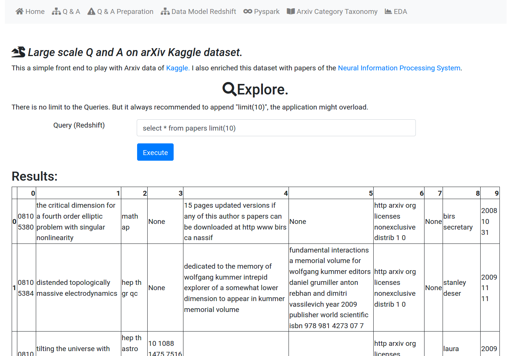
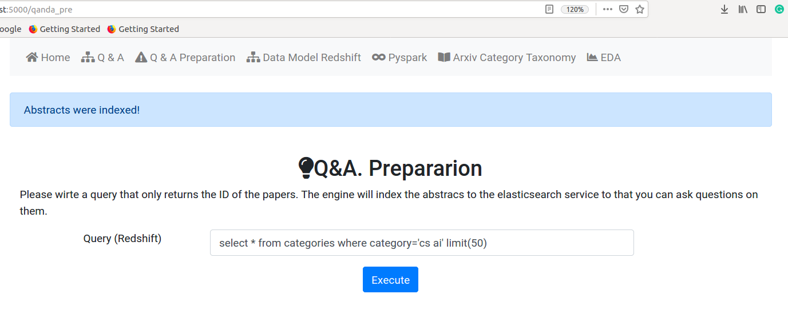
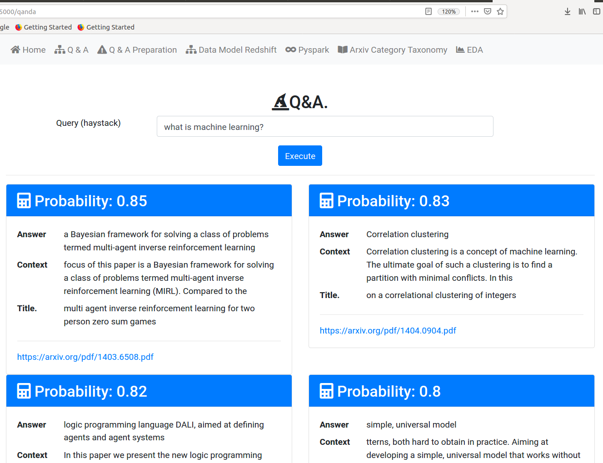
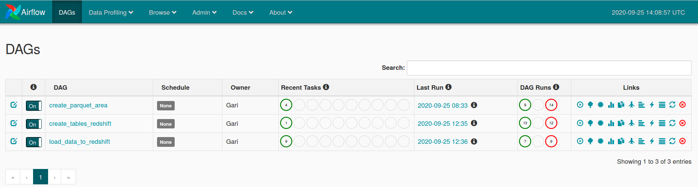
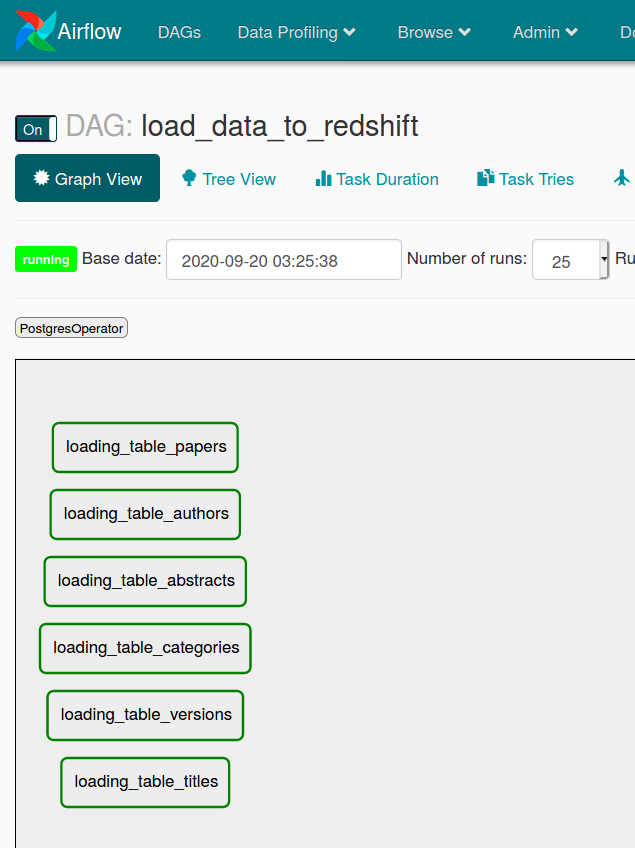

### Still under dev!
# Large scale Q and A on arXiv Kaggle dataset.

This is the final project of my nanodegree on udacity called Data engineering.
For the back-end, Airflow is used for etl orchestration, this includes: 
processing the original .json file of arXiv(stored on S3) on an pypspark cluster (EMR on AWS), saving the star
data model on parquet files again in S3 and then copy those files into redshift. Redshift serves a Flask application
where the user can explore the data sets using queries. 
With [haystack](https://github.com/deepset-ai/haystack) + local elasticsearch server on top to index, read, and answers question of
specific paper of arXiv.

Some of the tables are enriched with papers of the [Neural Information Processing System](https://www.kaggle.com/benhamner/nips-papers). The main
source of information is the [arXiv](https://www.kaggle.com/Cornell-University/arxiv).


## Flask + Bootstrap front end.
### explore arXiv kaggle data set.


### Use redshift to index only the abstracts that you think are relevant for a given task.


### Ask questions!


## Airflow + S3 + EMR + Redshift back-end.





## Usage

clone the repository. Execute con termial: 

```
conda create -n app python=3.6
conda activate app
pip install "apache-airflow[s3, postgres]"
pip install -U Werkzeug==0.16.0
conda install pandas 
pip install paramiko
pip install sshtunnel
pip install git+https://github.com/deepset-ai/haystack.git
conda install flask
pip install psycopg2
pip install boto3
pip install pandas
pip install wtforms
pip install configparser
```

An elastic search cluster is needed, you can get it with docker on ./docker_elastic_search

```
docker build -t elastic .
sudo docker run -d -p 9200:9200 -e "discovery.type=single-node" elastic
```


