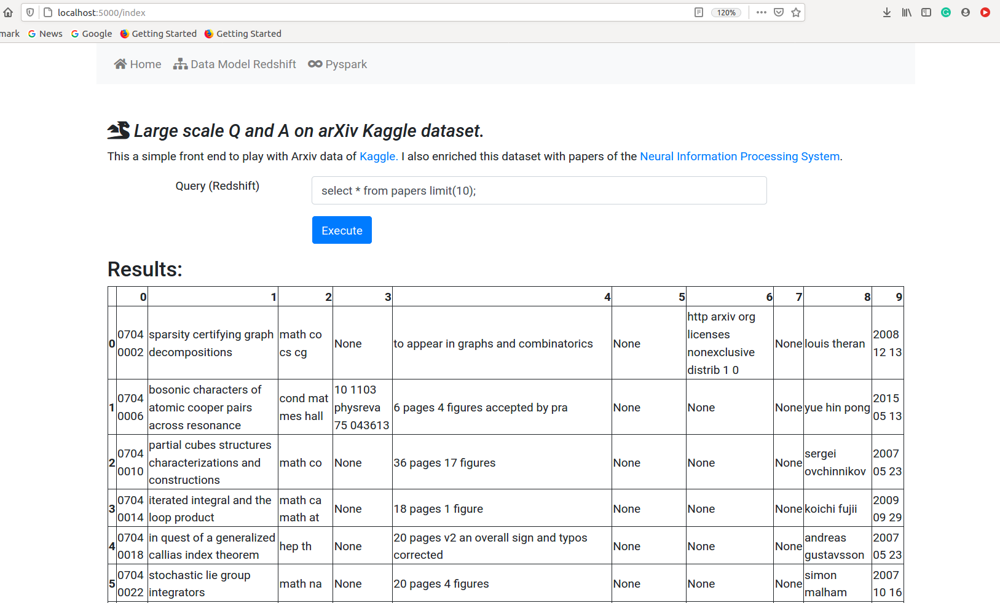
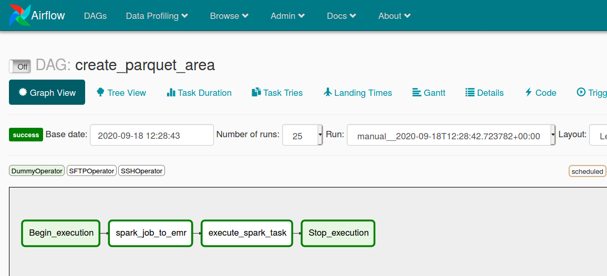

### Still under dev!
# Large scale Q and A on arXiv Kaggle dataset.

This is the final project of my nanodegree on udacity called Data engineering.
For the back-end, Airflow is used for etl orchestration, this includes: 
processing the original .json file of arXiv(stored on S3) on an pypspark cluster (EMR on AWS), saving the star
data model on parquet files again S3 and then copy those files into redshift. Redshift serves an Flask application
where the user can explore the data sets using queries. In the following days I will add more functionality. I want 
to ultimately build an elasticsearch instance with [haystack](https://github.com/deepset-ai/haystack) on top to index, read, and answers question of
specific paper of arXiv.

Some of the tables are enriched with papers of the [Neural Information Processing System](https://www.kaggle.com/benhamner/nips-papers). The main
source of information is the [arXiv](https://www.kaggle.com/Cornell-University/arxiv).

## Flask + Bootstrap front end.

## Airflow + S3 + EMR + Redshift back-end.

