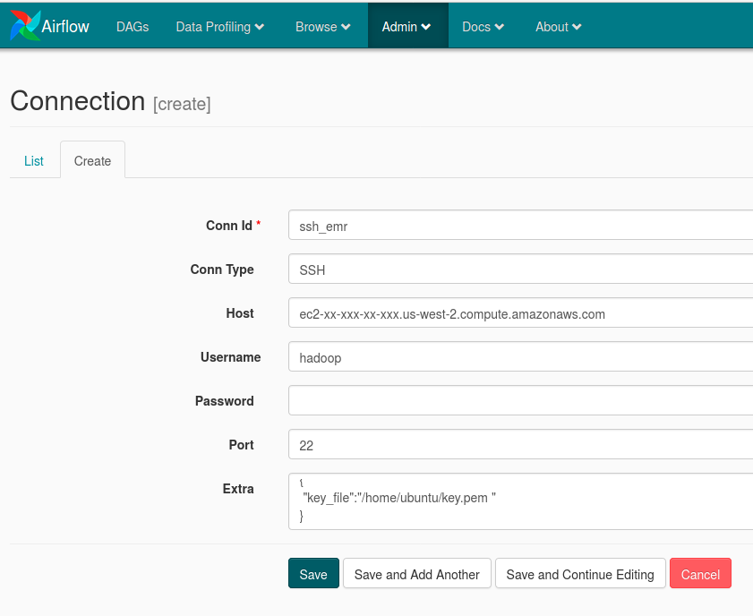
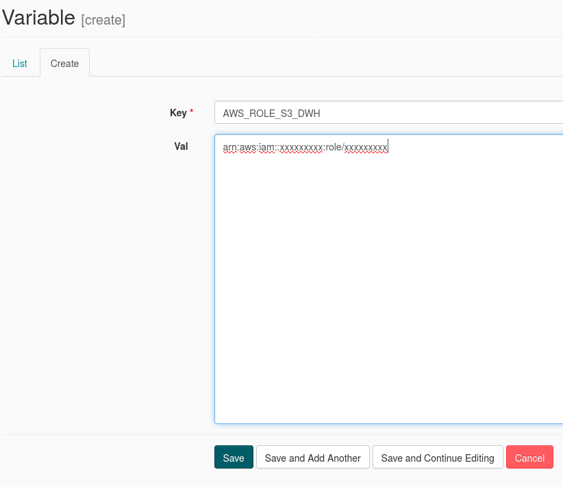

# arXiv-haystack-app Back-end
------------------------------------

leverage Airflow web UI to control the processes necesary to run the 
arXiv-haystack-app. 

### Folder structure
```
├── dags
│   ├── createRedShiftDB.py
│   ├── RedShiftDataModel.py
│   └── sparkPreProcess.py
├── Dockerfile
├── plugins
│   ├── __init_.py
│   ├── operators
│   │   ├── data_quality.py
│   │   ├── __init__.py
├── README.md
└── scripts
    ├── awsScripts
    │   ├── checkRedShiftStats.py
    │   ├── createAwsBucket.py
    │   ├── createEMR.py
    │   └── createRedshift.py
    └── pysparkCreateParquets_TEMP.py
```


### Usage
You need to create the database structure on Redshift, then process raw input data
with EMR and finally copy the parquets files from s3 to Redshift.

### Run airflow webserver with docker.
``` 
sudo docker build -t back-end .
sudo docker run -it --network=host back-end 
```

## Dags


+ To run dag ```create_tables_redshift (createRedShiftDB.py)``` you need to configure the
```redshift``` Connection  in the ariflow webserver. This dag will create 
start scheme of the dabase on Reshift.

#### redshift connection example
-------------------------------------------


+ To run dag ```create_parquet_area (sparkPreProcess.py)``` you need to configure 
``` ssh_emr  ``` ssh Connection to your EMR cluster.
#### ssh_emr connection example
-------------------------------------------


+ To run dag ```load_data_to_redshift (RedShiftDataModel.py)``` you need to create
the variable ```AWS_ROLE_S3_DWH```.
#### AWS_ROLE_S3_DWH variable example 
-------------------------------------------


### Auxiliar scripts/awsScripts

With this scripts you can create create a redshift cluster, EMR cluster, and
check status of the redshift cluster.

#### creater redshift cluster
Check the python file to provide your AWS credentials.
+ ```python createRedshift.py --action create```

Check the status, if the cluster is runnning, this will return the host amd
ARN role.
+ ```python checkRedShiftStats.py ```
 ```
DWH_ENDPOINT  xxxxx.xxxxxxxxxxxx.us-west-2.redshift.amazonaws.com
DWH_ROLE_ARN  arn:aws:iam::xxxxxxxxxxxx:role/xxxxx
```