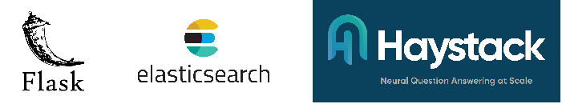
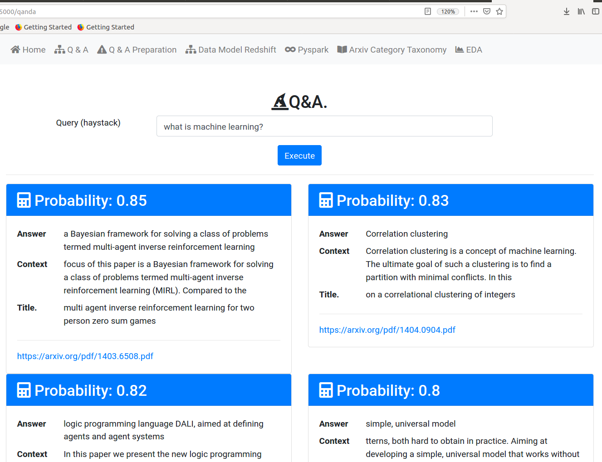
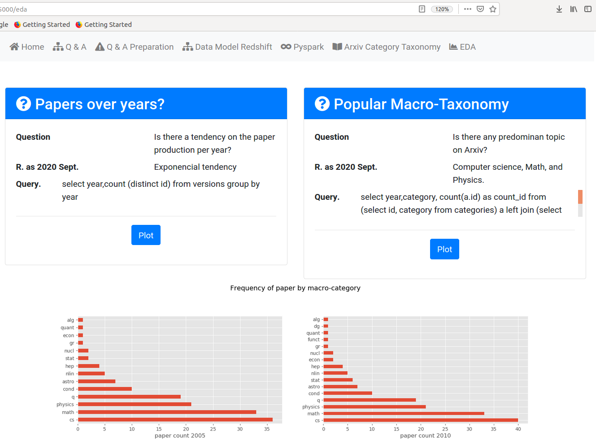

# arXiv-haystack-app Front-end
------------------------------------


### Folder structure
Interact with arXiv-haystack-app using flask web application. I assumed you already setup the
back-end, that is, airflow pipeline were executed and redshift is up and running.

```
├── app.py
├── Dockerfile
├── forms.py
├── README.md
├── requirements.txt
├── routes.py
├── static
│   ├── paper_prod.png
│   ├── paper_topics.png
│   └── temp_pdf_storage
└── templates
    ├── base.html
    ├── categories.html
    ├── db_info.html
    ├── eda.html
    ├── index.html
    ├── qanda.html
    ├── qanda_pre.html
    └── spark_pro.html
```

### Usage
Before starting the the flask application make sure your local elastic search cluster is running. 

+ Run elastic search cluster container (go to docker_elastic_search folder) 
on port 9200
```
docker build -t elastic .
sudo docker run -d --network=host -e "discovery.type=single-node" elastic
```
+ Run front-end container (got to front-ent folder) to start flask-app on port 5000. Notice
that we pass our locar aws configuration file to the container:
```
sudo docker build -t front-end --build-arg CREDENTIALS="$(cat ~/.aws/credentials)" .
sudo docker run -it --network=host front-end
```
+ AWS configuration (~/.aws/credentials) file should look like this:
```
[credentials]
KEY=xxxxxxxxxxxxxx
SECRET=xxxxxxxxxx
REGION=us-west-2
[default]
aws_access_key_id = xxxxxxxxxxxxxxxx
aws_secret_access_key = xxxxxxxxxxxxxxxxx
[DWH] 
DWH_CLUSTER_TYPE=multi-node
DWH_NUM_NODES=2
DWH_NODE_TYPE=dc2.large
DWH_IAM_ROLE_NAME=xxxxxxx
DWH_CLUSTER_IDENTIFIER=xxxxxxxx
DWH_DB=xxxxxxxx
DWH_DB_USER=xxxxxxxxx
DWH_DB_PASSWORD=xxxxxxx
DWH_PORT=5439
DWH_HOST=xxxxxxxxx.xxxxxxxxxxxx.us-west-2.redshift.amazonaws.com
DWH_ROLE=arn:aws:iam::xxxxxxxxxxxxx:role/xxxxxxxxx
[APP]
S3_BUCKED=arxivs3
```
### Workflow

1. start elastic search container
2. start front-end container
3. on URL ``` home ``` you can execute queries to redshift.
4. on URL ``` Q & A Preparation ``` you can execute queries that only return the id of the paper you want to index to the elastic search server. e.g. ``` select id from categories  where category='cs ai' limit(50)  ```
5. Once the indexing happened, on URL ``` Q & A ```, you can ask question on those documents e.g. ``` what is machine learning?```, I would get :



6. on URL ``` EDA ``` you can explore some typical EDA.


7. The others URLS contain auxliar information on the data model, ETL, and Arxiv topics.