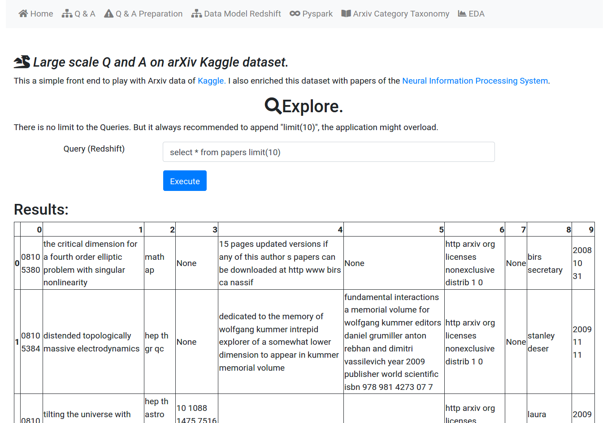
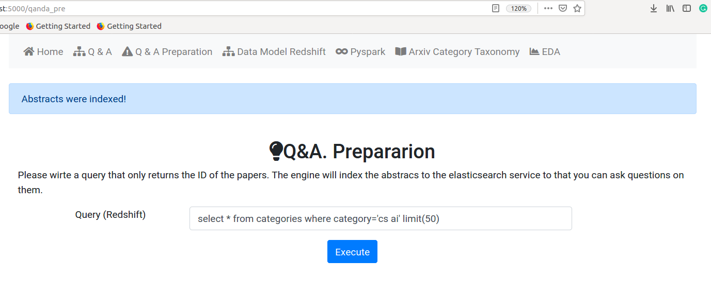

# arXiv-haystack-app Front-end
------------------------------------


### Folder structure
interact with arXiv-haystack-app using flask web application.

```
├── app.py
├── Dockerfile
├── forms.py
├── README.md
├── requirements.txt
├── routes.py
├── static
│   ├── paper_prod.png
│   ├── paper_topics.png
│   └── temp_pdf_storage
└── templates
    ├── base.html
    ├── categories.html
    ├── db_info.html
    ├── eda.html
    ├── index.html
    ├── qanda.html
    ├── qanda_pre.html
    └── spark_pro.html
```


## Web app

-------------------------------------


---------------------------------------


-----------------------------------------


---------------------------------

